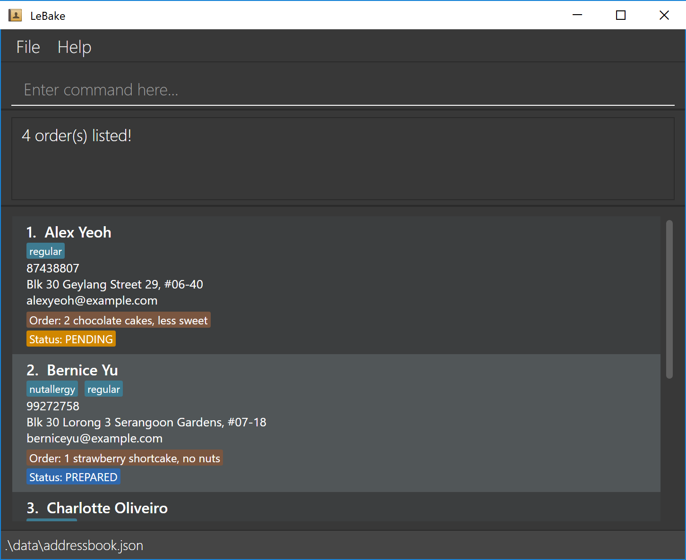

LeBake is a desktop application for tech-savvy independent home bakers who handle high volumes of seasonal pre-orders
on their own. It helps them keep track of orders and customer delivery addresses in one place, reducing the hassle of 
juggling customer information. LeBake's planned pre-order features will associate each customer's current order and
fulfilment status with their contact details, allowing home bakers to quickly identify orders requiring their attention,
whilst retaining customer information for future seasons.

LeBake is designed for bakers who prefer a CLI-focused workflow, with its text-based commands allowing for quick entry,
retrieval and updates.

## Documentation

* [User Guide](docs/UserGuide.md) — how to use LeBake.
* [Developer Guide](docs/DeveloperGuide.md) — how LeBake is designed and developed.
* [Project website](https://ay2627s1-cs2103t-f09-3.github.io/tp/) — the published guides and project information.
* [Team repository](https://github.com/AY2627S1-CS2103T-F09-3/tp) — source code and project updates.

## Acknowledgements

This project is based on the AddressBook-Level3 project created by the [SE-EDU initiative](https://se-education.org).
